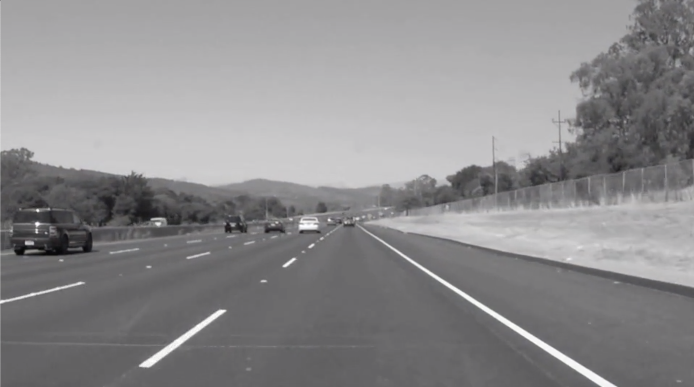

# **Finding Lane Lines on the Road** 

### Overview

When we drive, we use our eyes to decide where to go.  The lines on the road that show us where the lanes are act as our constant reference for where to steer the vehicle.  Naturally, one of the first things we would like to do in developing a self-driving car is to automatically detect lane lines using an algorithm.

In this project we detect lane lines in images using Python and OpenCV. 

### 1. Pipeline:

The pipeline broadly consists of 5 steps. The output after each stage is shown:

1) The images are converted to grayscale:

2) Gaussian Smoothing is applied with a kernel size of 5.

3) Canny Edge detection is used next with low and high thresholds 50 and 150 respectively.

4) We specify a Region of interest (RoI) and mask all the values of the image returned by the previous step outside this RoI as 0. Hough transform is then applied on top of the masked output to get the detected lines. However, these lines are disjoint on either side and we so, modify the `drawLines()` functions (explained later) to extrapolate the detected lines so that they form one continuous chunk on both sides.

5) Finally, we superimpose this on top of the image to get the final result.

As mentioned in Step 4 above, Hough transform returns various lines which are discontinuous on either side. But we want a single lane line. There are various ways to do this. The approach I followed was to first identify the lane line with the maximum length on both sides. We already specify the RoI and using the RoI vertices, we identify the top horizontal line and the bottom horizontal line. Then, we find the intersection of the largest left and right lane lines with both the top and bottom horizontal lines. An example is shown below:

### The Project

If you have already installed the [CarND Term1 Starter Kit](https://github.com/udacity/CarND-Term1-Starter-Kit/blob/master/README.md) you should be good to go!   If not, you should install the starter kit to get started on this project.

**Step 1:** Set up the [CarND Term1 Starter Kit](https://classroom.udacity.com/nanodegrees/nd013/parts/fbf77062-5703-404e-b60c-95b78b2f3f9e/modules/83ec35ee-1e02-48a5-bdb7-d244bd47c2dc/lessons/8c82408b-a217-4d09-b81d-1bda4c6380ef/concepts/4f1870e0-3849-43e4-b670-12e6f2d4b7a7) if you haven't already.

**Step 2:** Open the code in a Jupyter Notebook

You will complete the project code in a Jupyter notebook.  If you are unfamiliar with Jupyter Notebooks, check out [Udacity's free course on Anaconda and Jupyter Notebooks](https://classroom.udacity.com/courses/ud1111) to get started.

Jupyter is an Ipython notebook where you can run blocks of code and see results interactively.  All the code for this project is contained in a Jupyter notebook. To start Jupyter in your browser, use terminal to navigate to your project directory and then run the following command at the terminal prompt (be sure you've activated your Python 3 carnd-term1 environment as described in the [CarND Term1 Starter Kit](https://github.com/udacity/CarND-Term1-Starter-Kit/blob/master/README.md) installation instructions!):

`> jupyter notebook`

A browser window will appear showing the contents of the current directory.  Click on the file called "P1.ipynb".  Another browser window will appear displaying the notebook.  Follow the instructions in the notebook to complete the project.  

